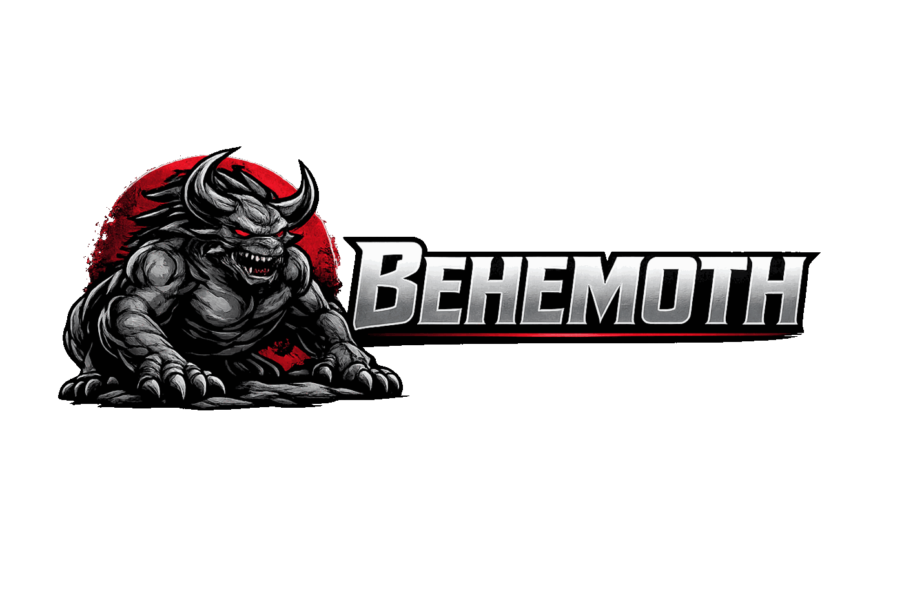

<p align="center">
  
</p>

# Behemoth

Behemoth is a native multi-engine data platform focused on one practical goal: provide the right storage model for each workload behind a single runtime and transport surface.

It combines relational, key-value, columnar, vector, file, and graph capabilities in one service, while keeping the implementation compact and deployment-friendly.

## Problem Statement

Behemoth is designed to solve a concrete bottleneck: I/O pressure in Bun-centric runtime paths can block the event loop and reduce effective throughput under mixed workloads.

The project moves critical data-path operations into native components and a dedicated transport/runtime layer to avoid event-loop stalls, reduce latency spikes, and maximize useful work per CPU time slice.

It also addresses architectural coupling problems typical for shared monolithic databases in SaaS systems: large shared indexes, tenant data mixing risk, and difficult service-level evolution.

## Target Environments

Behemoth targets two extremes with the same architecture:

- Super-compact platforms where memory and storage footprint must stay minimal.
- Cloud environments where high throughput per core and predictable latency are required.

## Operations Model

Behemoth is designed for low-ops operation:

- Stores run on a single node in the current model.
- No dedicated database administration layer is required for routine service operation.
- Operational focus stays on application and service lifecycle, not heavyweight DB fleet management.

## Why Behemoth

- One runtime for multiple data models instead of operating many separate databases per feature.
- Engine-per-workload approach: each store type uses a backend that is strong in that class.
- Native-first implementation (Zig/C/C++) with low operational overhead.
- Unified transport layer and JS/Bun bindings for integration from application services.
- Microservice-first storage isolation: each service owns its own store boundary.
- Tenant-first storage isolation: each business tenant can receive dedicated micro-stores.

## SaaS Isolation Model

Behemoth is designed as a microservice storage platform for SaaS environments:

- Each business tenant gets isolated micro-storage units with minimal memory usage.
- Each microservice keeps its own isolated storage boundary.
- No cross-tenant data mixing by design at storage layout level.
- No cross-service index coupling by design.

This model improves security, tenancy isolation, and operational predictability for business cloud deployments.

## Why Small Is Better Here

Instead of one ever-growing shared database, Behemoth favors many compact stores:

- Smaller indexes per store, which stay fast and cache-friendly.
- Lower risk of global index/database bloat.
- Better blast-radius control: one store issue does not degrade the full tenant universe.
- Easier microservice evolution, versioning, and upgrades without global schema lockstep.
- Better horizontal data distribution options because data is naturally partitioned.

## Fault Isolation And Recovery

Store-level isolation also improves resilience and recovery behavior:

- If one isolated store is corrupted (rare), other stores remain intact.
- Other microservices continue operating because their storage boundaries are independent.
- Recovery can be targeted to the affected store/service instead of restoring a global monolithic database.
- Per-microservice dumps can be produced independently, often in megabytes or less for compact service datasets.

## Replication Roadmap

For clustered deployments, the planned replication model is:

- Single writer per store/shard.
- Multiple read copies/replicas.
- Replica convergence via disk-level synchronization workflows.

This keeps the write path deterministic while enabling scale-out reads and resilient recovery topologies.

## Purpose

Provide a unified native data runtime for platform services that need different storage models without fragmenting the architecture into many unrelated data stacks.

## Responsibility Boundary

Behemoth owns native storage and transport foundations.
It does not own product business workflows, UI logic, or domain orchestration policies.

## Storage Types

| Store Type | Primary Use | Engine Under The Hood |
| --- | --- | --- |
| `sql` | Transactions, relational data, standard SQL access | `sqlite3` |
| `kv` | Low-latency key-value access and range/prefix operations | `lmdbx` |
| `column` | Column-oriented analytics-like access patterns | `column` module over `sqlite3` |
| `vector` | Embeddings and similarity search | `sqlite3` + `sqlite-vec` |
| `files` | Binary/blob file persistence | Filesystem-backed engine (`std.fs`) |
| `graph` | Graph-shaped data and graph traversal/query workloads | `ryugraph` |

## Engine Advantages

### `sqlite3` (SQL Foundation)

- One of the most battle-tested embedded databases in production ecosystems.
- Strong reliability profile, predictable behavior, and mature SQL tooling.
- Excellent compactness and deployment simplicity for embedded/service-local usage.

### `lmdbx` (KV Foundation)

- High-performance B+tree KV engine with very low overhead and strong read performance.
- Widely trusted in systems that need predictable latency and robustness.
- Efficient footprint and operational simplicity compared with heavyweight network KV servers.

### `sqlite-vec` (Vector Extension)

- Adds vector search to a compact SQLite-based stack.
- Useful when you want vector capability without deploying a dedicated heavy vector database.
- Good balance of practical performance and minimal operational complexity.

### `ryugraph` (Graph Foundation)

- Purpose-built graph engine for graph-native workloads.
- Better fit for traversal-heavy/query-connected data than forcing graph logic into pure relational layouts.
- Keeps graph concerns isolated while still integrated into the same Behemoth runtime.

### Filesystem Engine (`std.fs`)

- Direct and efficient for binary asset/blob persistence.
- Minimal abstraction overhead and strong portability.
- Compact by design: no extra database layer when object semantics are file-native.

### Column Layer (on top of SQLite)

- Reuses a mature SQL core while providing column-oriented access behavior for analytics-style workloads.
- Avoids introducing another heavy external dependency for this access model.
- Keeps deployment compact while covering a broader query profile.

## Transport Architecture

Behemoth transport is optimized for very fast local/native communication:

- Unix domain sockets for low-overhead local IPC.
- Cap'n Proto as the wire format and RPC layer.
- Native transport implementation (`transport/`) with bindings for Bun/Node (`bun-transport/`).

This combination minimizes serialization and syscalls overhead compared to heavier network-first stacks.

## Concurrency Model

Behemoth uses a multi-threaded execution model to isolate heavy operations:

- Engine-specific execution paths run in dedicated threads.
- Work is separated by engine/store type to reduce cross-workload contention.
- Transport and storage responsibilities are decoupled to avoid blocking critical request paths.

The practical result is better CPU quantum utilization and more stable latency under mixed traffic.

## Built-In Store Metadata

Each store carries metadata used by the runtime for lifecycle control:

- Store manifest metadata (`manifest.json`) to track store identity/type.
- Migration tracking hooks for controlled schema/data evolution.
- Dump/archive lifecycle support for backup and portability operations.

This makes migration and dump management part of the engine workflow, not an external afterthought.

## Architecture

- `storage/`: core storage runtime and multi-engine dispatch.
- `transport/`: Cap'n Proto transport layer and wire protocol implementation.
- `bun-transport/`: Bun/Node-compatible bindings for integration from JS services.

## Data Layout

```text
<data-dir>/
  <ms-name>/
    <store-name>/
      manifest.json
      data/
        data.db      # sqlite-backed stores
        mdbx.dat     # lmdbx-backed stores
        ...          # files/graph/vector specific artifacts
```

## Build (Storage)

```bash
cd storage
zig build -Dall -Doptimize=ReleaseFast
```

## Build (Transport)

```bash
cd transport
zig build -Dall -Doptimize=ReleaseFast
```

## Build (Container)

```bash
podman build --layers -f storage/Containerfile -t behemoth .
```
